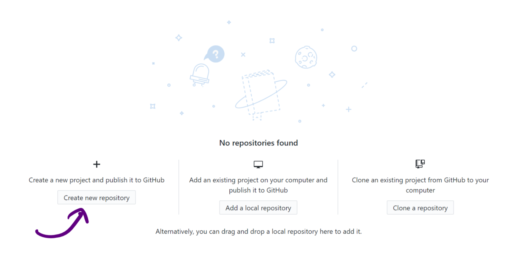
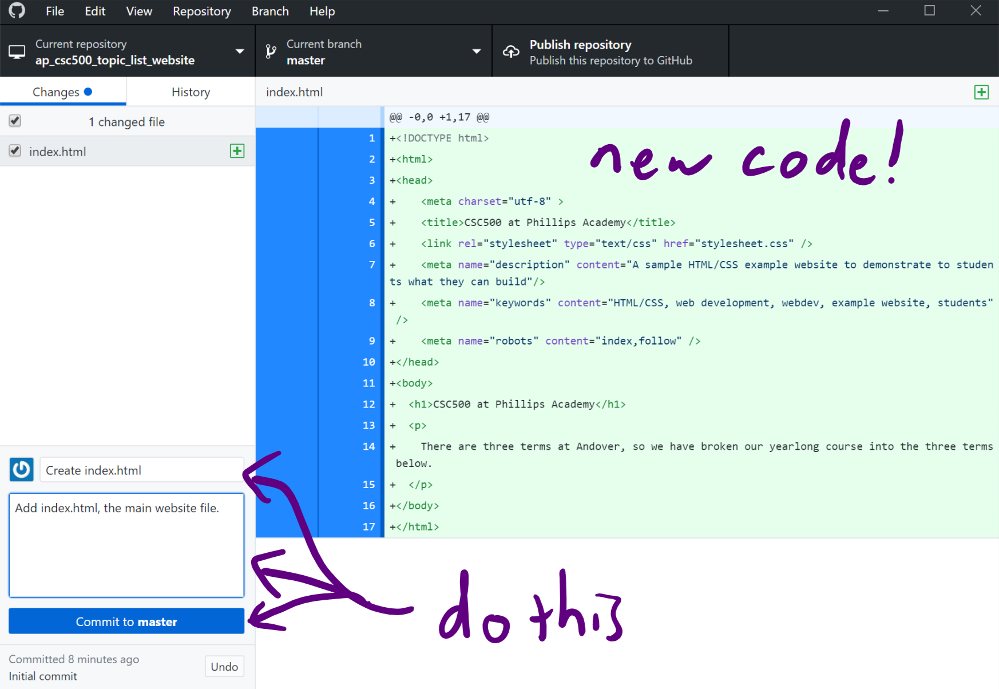
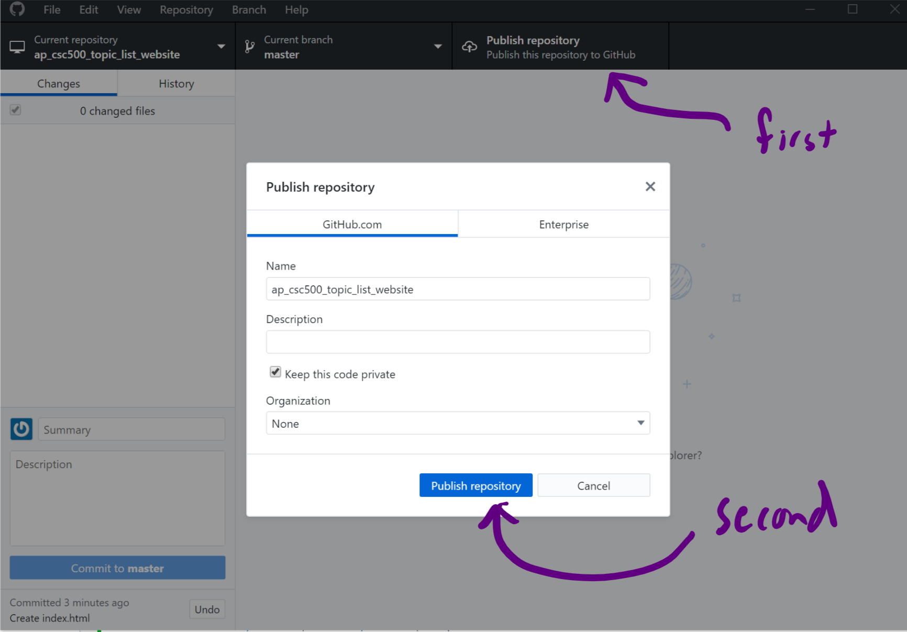
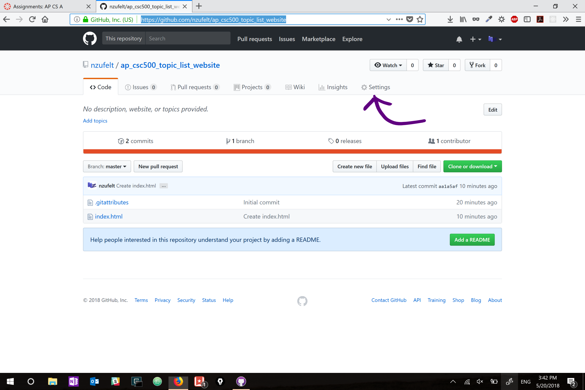
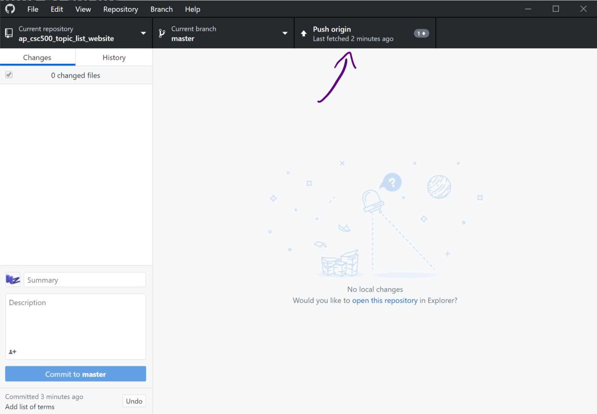

# Hosting your html document using GitHub Pages

### One-time steps
0. Download [GitHub Desktop](https://desktop.github.com/).  Once you install and set it up, you'll be prompted to either create a GitHub account, or sign in on your existing one.
1. Once you're logged into your account on GitHub Desktop, select "Create New Repository".  Enter a name for the repository (where your code will sit both on GitHub's servers and on your own computer).  All the other options can be tweaked if you want (like the description), but don't need to be.  Notice that the main window on the next page will let you "open this repository" in Finder/Explorer.  Click that!

2. Now, put your `index.html` file into that folder, and go back to GitHub Desktop.  You should see your file in the window with lots of green lines with plusses.  These are additions to your repository's code!  Enter the text in the image into the commit's Name and Description, then click "Commit to **master**".  A commit is like a "save" of your code.

3. Now press the "Publish Repository" button to send your new code up to GitHub.  The only thing you should do is uncheck the "Keep this code private" button (that would cost money).

4. After that completes, you now have a repository on GitHub that you need to keep sending your code up to.  Navigate to your new repository in your web browser by going to [https://github.com/<your_username>/<repository_name>](https://github.com/).  (You have to fill in those values yourself.)  For example, mine was [https://github.com/nzufelt/ap_csc500_topic_list_website](https://github.com/nzufelt/ap_csc500_topic_list_website).  Click on the Settings tab.

5. Scroll down to "GitHub Pages", change "None" to "master branch", and hit "save".  After that, if you scroll back to the "GitHub Pages" section of the settings, then you should now have a link that you can navigate to, hosting your website.  Mine was [https://nzufelt.github.io/ap_csc500_topic_list_website/](https://nzufelt.github.io/ap_csc500_topic_list_website/).  If you go to that website, you should see the version of your website that is currently available up on GitHub's servers.

### Each time you update
Now, each time you make another change to the local repository (in that special folder on your computer that you opened in \#1 above), you won't see the changes on your live version on GitHub.  In order to see that, you'll have to "push" your changes up to GitHub.  This requires a couple of steps:
1. Make whatever changes you want to your local code in your repository.  When you go back to GitHub Desktop, you should see the lines you've deleted, changed, and added to your code.

2. You'll need to commit this code (perform another "save") that can be "pushed" up to GitHub.  Fill out the Name and Description like you did in \#2 above.
3. Push the "Push origin" button to send your changes up to GitHub.  Give it a second or so, then refresh your website in the browser to see your changes!

